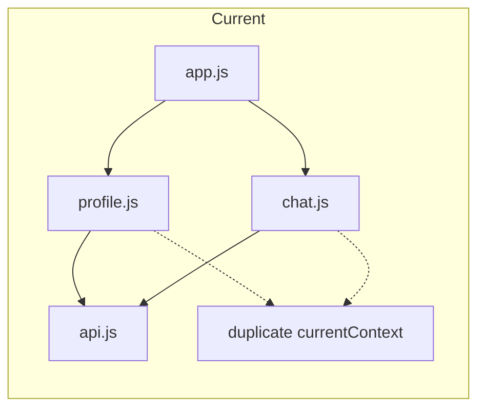
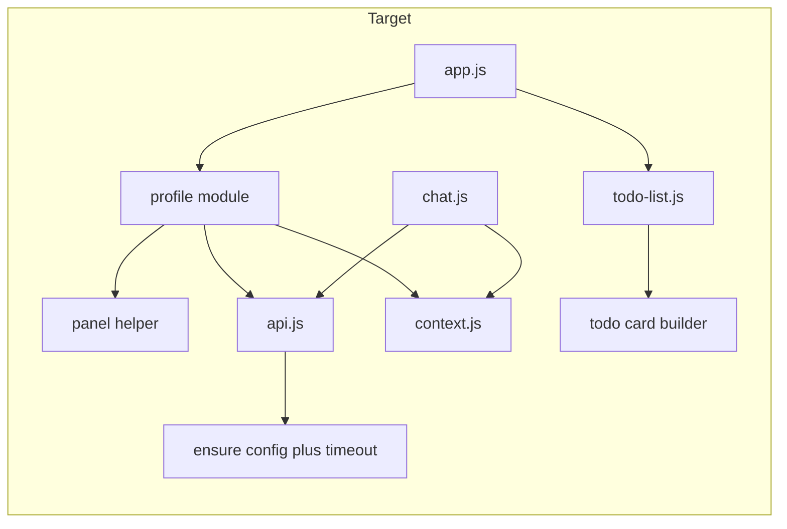

# Web App Top-to-Bottom Review (Frontend Cleanup)

Focus: **cleanup of the frontend** — correctness, complexity reduction, common abstractions, and fixing the profile. Polling and WebSockets are **phase two** (see end of document).

---

## Current state (summary)

- **Entry:** [web/js/app-entry.js](web/js/app-entry.js) loads config, jwt, dateutils, api, auth, chat, profile, app. [web/js/app.js](web/js/app.js) is ~760 lines and owns todo list render, drag-drop, API status, edit mode, and all event handlers.
- **Profile:** [web/js/profile.js](web/js/profile.js) opens a panel and calls `getCurrentUser()`, `getAIContext()`, `getTagStats()` in parallel. It does **not** ensure config is ready before `getCurrentUser()` (unlike `getAIContext`/`getTagStats`, which await `CONFIG_LOADED` in api.js). There is no request timeout; a hanging request would leave the UI stuck on "Loading...". Context state is duplicated between profile and [web/js/chat.js](web/js/chat.js) (`currentContext` in both).
- **Backend:** Auth `/api/v1/auth/me` returns `{ success, data: user, timestamp }`; user has `id`, `email`, `name` (nullable). AI context and tag stats use the same wrapper. The frontend's expectation of `response.data` is correct; the bug is likely **config timing** and/or **hanging requests** (no timeout).

---

## 1. Profile: rip out and replace

**Goal:** Remove the current profile implementation and replace it with a new system that never gets stuck on "Loading...".

**Root cause fixes:**

- **Config:** In [web/js/api.js](web/js/api.js), make `getCurrentUser()` (and any other auth/me caller) await `window.CONFIG_LOADED` before calling `apiRequest`, matching `getAIContext`/`getTagStats`. Alternatively, centralize "ensure config" inside `apiRequest` once so all endpoints benefit.
- **Timeout:** Add a timeout (e.g. `AbortSignal.timeout(10000)`) for profile-related requests so a hanging request doesn't leave the UI in "Loading..." forever. Expose a small helper in api.js (e.g. `apiRequestWithTimeout(endpoint, options, ms)`) or pass `signal` into profile fetch only.
- **Single load path:** Replace the current profile panel with a new module that:
  - Has one clear "load profile data" function that: awaits config, then fetches user + context + tag stats (with timeout), then updates the DOM or passes data to the card/panel abstraction.
  - Does not duplicate context state with chat; either own context in one place (e.g. a small "context" module) or have profile read/write via that module so chat and profile stay in sync.

**Concrete steps:**

- Remove [web/js/profile.js](web/js/profile.js) current implementation (init, loadProfileData, handleUserResult, handleContextResult, handleTagStatsResult, renderTagStats, handleSaveContext, getCurrentContextText).
- Add in api.js: ensure `getCurrentUser` (and if needed other callers) await config; add optional timeout for profile fetches (or a dedicated `getProfileData()` that runs the three requests with a single timeout).
- Implement a new profile module (e.g. `profile.js` or `profile-panel.js`):
  - One function to fetch all profile data (user, context, tag stats) with config + timeout.
  - Render user info, context textarea, tag stats, and logout in a panel that uses the new **card/panel abstraction** (see below).
  - Save context via api; update the single source of truth for context so chat and profile stay in sync.
- Update [web/app.html](web/app.html) so the profile panel is either the same container with new structure or a minimal placeholder that the new code fills.
- Wire the new profile into [web/js/app.js](web/js/app.js) (e.g. `initProfile()` or equivalent) and remove any old profile imports.

---

## 2. Common abstraction for page elements (cards, panels)

**Goal:** One consistent model for "card-like" and "panel/modal-like" UI so we can reuse behavior and reduce duplicated DOM/event logic.

**Approach:** Use a **minimal, well-supported open source** option for overlay/panel behavior (e.g. a tiny modal/panel library), and introduce a small **internal abstraction** for "content cards" (todo card, profile content) that works with that library or with vanilla show/hide.

**Suggested direction:**

- **Panels/modals:** Pick a small dependency (e.g. [inert polyfill](https://github.com/WICG/inert) for accessibility, or a minimal modal/panel library that supports open/close, focus trap, and backdrop). Use it for:
  - Profile panel (and later, if desired, API status dropdown).
- **Cards:** Keep a single "card" contract in our codebase:
  - **Todo card:** One function or small module that, given a todo object, returns or renders a DOM node (with actions: edit, complete, delete, reprocess); app.js or a thin "todo-list" module calls it and handles drag-drop.
  - **Profile "card" (content):** One function or small module that, given `{ user, context, tagStats }`, returns or fills the profile panel content (no open/close logic inside it).
- **Shared behavior:** Open/close and "loading/error/success" states live in the panel/modal layer or in a tiny helper (e.g. `setContent(container, { loading, error, content })`) so both profile and future panels share the same pattern.

**Concrete steps:**

- Add one minimal dependency for overlay/panel (research and choose: e.g. a11y-focused modal or panel utility; avoid heavy frameworks).
- Introduce `js/cards/` or `js/panels/` (or equivalent) with:
  - A small **panel** helper that: shows/hides a panel, supports "loading" and "error" states, and accepts a content render function or DOM node.
  - **Todo card** builder: move the "create one todo element" logic out of app.js into a single place (e.g. `todoCard(todo, handlers)`) and keep drag-drop and list rendering in app.js or a dedicated todo-list module.
  - **Profile content** builder: given profile data, return or fill the inner content of the profile panel (user info, textarea, tag stats, logout button); the new profile module uses the panel helper + this builder.
- Refactor [web/js/app.js](web/js/app.js) to use the todo card builder and, if applicable, the panel helper for any existing modal-like behavior (or leave API status dropdown as-is for this phase and only use the panel helper for profile).

---

## 3. Node/JS best practices and complexity

- **Config:** Prefer a single place that "ensures config": e.g. `apiRequest()` (or a wrapper used by all API calls) awaits `CONFIG_LOADED` once and caches `API_BASE_URL`, so individual functions like `getCurrentUser`, `getAIContext`, `getTagStats` don't each check. Document in [web/docs/WEB_APP_REVIEW.md](web/docs/WEB_APP_REVIEW.md).
- **api.js:** Remove redundant `window.*` assignments for API functions if all callers use ES module imports (per [web/docs/WEB_APP_REVIEW.md](web/docs/WEB_APP_REVIEW.md)); keep the API surface as exports only.
- **Error handling:** Keep using a single `showError` from [web/js/error-utils.js](web/js/error-utils.js) everywhere; ensure the new profile module uses it for timeout and API errors so the user never sees an endless "Loading...".
- **Split app.js:** Extract todo list rendering and drag-drop into a dedicated module (e.g. `todo-list.js`) that uses the new todo card abstraction; leave app.js as bootstrap, event wiring, and high-level handlers. Optionally extract API status UI into `api-status.js` as in the review doc.

---

## 4. Replace home-grown with well-supported modules

- **HTML escaping:** [web/js/html-utils.js](web/js/html-utils.js) is a few lines. Replacing with a small lib (e.g. `he`) is optional; if we do, use it consistently (API status dropdown, tag stats, etc.).
- **Dates:** Already using `chrono-node` and `dayjs`; keep.
- **No new heavy deps:** Prefer one small panel/modal helper and, if needed, a tiny escape lib; avoid bringing in a full framework.

---

## 5. Reduce inappropriate cross-code dependencies

- **Context:** Have a single source of truth for "current AI context" (e.g. a small `context.js` or the same in a "user state" module) used by both chat and profile; remove duplicate `currentContext` from profile and chat.
- **Profile:** Should depend only on: api, auth, config (or centralized "ensure config"), error-utils, logger, and the new panel/card abstraction. It should not reach into app.js or chat.js.
- **Chat:** Should consume/update the shared context module instead of holding its own `currentContext`.
- **app.js:** Should import the new profile initializer and the todo-list module (if extracted); it should not contain inline "create todo DOM node" logic once the todo card abstraction exists.

---

## 6. Order of work (suggested)

1. **Config + timeout (api.js):** Centralize CONFIG_LOADED in api and add timeout support for profile fetches; fix `getCurrentUser` to await config.
2. **Panel/card abstraction:** Add minimal panel library and internal panel + todo-card helpers; optionally add profile-content builder.
3. **Profile replacement:** New profile module using config + timeout, single load path, shared context, and panel + profile-content builder; remove old profile.js logic and wire from app.js.
4. **Context single source of truth:** Introduce context module; refactor chat and profile to use it.
5. **Extract todo-list and slim app.js:** Move todo card creation into the card abstraction and list/drag-drop into todo-list.js; trim app.js to bootstrap and wiring.
6. **Cleanup:** Remove window.* from api.js, update WEB_APP_REVIEW.md and DEPENDENCIES.md, add a short "Profile" section to docs describing the new load path and timeout.

---

## 7. Out of scope for this plan

- Backend API changes (no change to `/api/v1/auth/me` or response shapes).
- Rewriting the app in a SPA framework (React/Vue/etc.); we stay with vanilla + minimal libs.
- Changing auth flow (OIDC) or JWT handling beyond ensuring profile requests use config and timeout.
- **Polling and WebSockets** (phase two; see below).

---

## 8. Diagram (high level)

---

## Phase two: polling and real-time updates

**Deferred to a later phase.** Current polling (3 s todos, 10 s health, 2 s extended health when dropdown open) stays as-is for this cleanup phase.

When you do phase two:

- You can move to **WebSockets** (or SSE) for the web client so it gets real-time todo updates (e.g. processing to processed) without polling.
- Keep the **vanilla REST API** unchanged for other clients (mobile, CLI, etc.); WebSockets would be an additional channel for clients that want push, not a replacement for REST.
